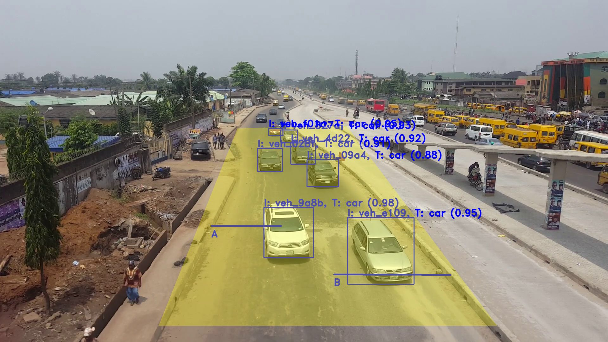

# Video-based Vehicle Counting System (VCS)


## Requirements
- Python 3

## Setup
- Clone this repo `git@github.com:nicholaskajoh/Vehicle-Counting.git`.
- Create and/or use a virtual environment.
- Run `pip install -r requirements.txt` to install dependencies.

## Run
- Create _.env_ from _.env.example_ in the project root and edit as appropriate.
- Run `python -m  main`.

## Demo
Download [vcs_demo_data.zip](https://drive.google.com/open?id=1sUeZ0aXemC5y7qU60jH8gd0r9ysBYdf5) and unzip its contents in the [data directory](/data). It contains detection models and a sample video of a traffic scene.

## Test
```
python -m pytest
```

## Debug
By default, the VCS runs in "debug mode" which provides you a window to monitor the vehicle counting process. You can press the `s` key when the program is running to capture a screenshot and use `q` to quit.

## How it works
The vehicle counting system is made up of three main components: a detector, tracker and counter. The detector identifies vehicles in a given frame of video and returns a list of bounding boxes around the vehicles to the tracker. The tracker uses the bounding boxes to track the vehicles in subsequent frames. The detector is also used to update the trackers periodically to ensure that they are still tracking the vehicles correctly. The counter counts vehicles when they leave the frame or makes use of a counting line drawn across a road.

__PS:__ You can find out about how the vehicle counting system was built by checking out this article on my blog: https://alphacoder.xyz/vehicle-counting/.

## Donate
Love this project? You can [buy me a coffee or two](http://buymeacoff.ee/nicholaskajoh) to support its continued development. 😊